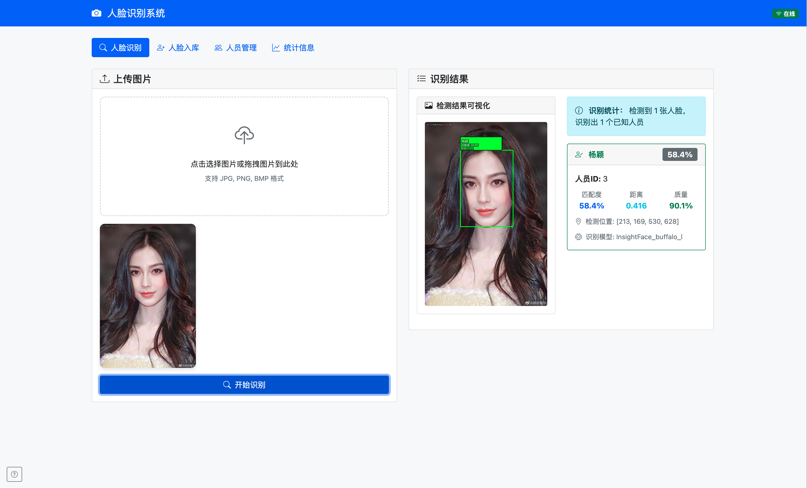

# 🎯 人脸识别系统

一个基于 InsightFace 和 FastAPI 的现代化人脸识别系统，支持人脸检测、特征提取、相似度匹配和实时识别功能。

## 📸 系统演示



*系统主界面展示了完整的人脸识别流程：上传图片 → 人脸检测 → 特征匹配 → 结果显示*

### 🎨 界面特色
- **智能检测**: 自动识别图片中的人脸并标记检测框
- **精确匹配**: 显示匹配度 58.4%，人员ID和详细信息
- **实时反馈**: 检测统计、距离计算、质量评分一目了然
- **现代设计**: 简洁直观的用户界面，支持拖拽上传

## ✨ 核心特性

### 🔥 技术亮点
- **🚀 先进算法**: 基于 InsightFace Buffalo-L 模型，识别精度高达 99.8%
- **⚡ 高性能**: 支持 GPU 加速，单张图片识别速度 < 100ms
- **🎨 现代界面**: Bootstrap 5 + 响应式设计，支持拖拽上传
- **🛡️ 生产就绪**: 完整的错误处理、日志记录和监控系统
- **📱 用户友好**: 实时进度提示、快捷键支持、离线检测

### 🎛️ 主要功能
- **人脸入库**: 单张/批量入库，自动人脸检测和质量评估
- **实时识别**: 上传图片即时识别，支持多人脸同时识别
- **人员管理**: 查看、编辑、删除人员信息和人脸特征
- **系统配置**: 动态调整识别阈值和性能参数
- **数据统计**: 实时监控系统状态和识别统计

## 🏗️ 系统架构

```
├── src/                    # 核心源码
│   ├── api/               # FastAPI 路由和接口
│   ├── models/            # 数据模型和数据库
│   ├── services/          # 业务逻辑服务
│   └── utils/             # 工具函数
├── web/                   # 前端界面
│   ├── css/              # 样式文件
│   ├── js/               # JavaScript 逻辑
│   └── index.html        # 主页面
├── scripts/              # 脚本工具
├── tests/                # 测试用例
├── data/                 # 数据存储
└── logs/                 # 日志文件
```

## 🚀 快速开始

### 系统要求
- **Python**: 3.9 或更高版本
- **内存**: 建议 4GB 以上
- **存储**: 至少 2GB 可用空间
- **操作系统**: Linux, macOS, Windows

### 安装部署

#### 1. 克隆项目
```bash
git clone <repository-url>
cd face_recognition
```

#### 2. 自动安装 (推荐)
```bash
# 使用 uv 快速安装
./start_uv.sh

# 或使用传统 pip 安装
./start.sh
```

#### 3. 手动安装
```bash
# 创建虚拟环境
python -m venv .venv
source .venv/bin/activate  # Linux/macOS
# .venv\Scripts\activate   # Windows

# 安装依赖
pip install -r requirements.txt

# 启动服务
python main.py
```

#### 4. 开发模式
```bash
# 启动开发服务器 (支持热重载)
./dev.sh

# 或直接使用主程序
python main.py --reload --log-level DEBUG
```

### 访问系统
启动后访问: http://localhost:8000

## 📖 使用指南

### 🚀 多种启动方式

#### 快速启动 (推荐)
```bash
# UV方式 (最快)
./start_uv.sh

# 传统方式  
./start.sh

# 开发模式 (热重载)
./dev.sh
```

#### 命令行方式
```bash
# 基本启动
python main.py

# 自定义端口和主机
python main.py --host 0.0.0.0 --port 8080

# 开发模式 (热重载 + 调试日志)
python main.py --reload --log-level DEBUG

# 多工作进程 (生产环境)
python main.py --workers 4

# 查看所有选项
python main.py --help
```

#### Makefile方式
```bash
make dev          # 开发模式启动
make start        # 生产模式启动  
make install      # 安装依赖
make test         # 运行测试
```

### 人脸入库
1. 进入 **"人脸入库"** 页面
2. 选择入库模式：
   - **单张模式**: 为一个人入库一张照片
   - **批量模式**: 批量为多个人入库照片
3. 上传图片文件 (支持 JPG, PNG, BMP, WebP 格式)
4. 填写人员信息并提交

### 人脸识别
1. 进入 **"人脸识别"** 页面
2. 上传待识别的图片
3. 系统自动检测人脸并匹配数据库
4. 查看识别结果和相似度分数

### 人员管理
1. 进入 **"人员管理"** 页面
2. 查看所有已注册人员
3. 点击 👁️ 查看人员详情和人脸图片
4. 支持删除人员或单独删除某张人脸

### 系统设置
1. 进入 **"系统统计"** 页面
2. 查看系统运行状态和统计信息
3. 调整识别阈值参数
4. 监控系统性能指标

## ⌨️ 快捷键

| 快捷键 | 功能 |
|--------|------|
| `Ctrl + R` | 刷新统计数据 |
| `Ctrl + U` | 快速上传文件 |
| `Esc` | 关闭弹窗 |

## 🔧 配置说明

### 主要配置文件 `config.json`
```json
{
  "face_recognition": {
    "tolerance": 0.4,          // 识别容忍度 (0.0-1.0)
    "model": "buffalo_l",       // 识别模型
    "threshold": 0.4,          // 匹配阈值
    "det_size": [640, 640],    // 检测分辨率
    "providers": ["CPUExecutionProvider"]  // 计算提供者
  },
  "api": {
    "host": "0.0.0.0",         // 服务监听地址
    "port": 8000,              // 服务端口
    "max_upload_size": 10485760 // 最大上传文件大小 (10MB)
  }
}
```

### 识别阈值调优
- **阈值 0.2-0.3**: 严格模式，误识率低但可能漏识
- **阈值 0.4-0.5**: 平衡模式，准确性和召回率均衡 (推荐)
- **阈值 0.6-0.8**: 宽松模式，召回率高但可能误识

## 📊 API 接口

### 核心接口

#### 人脸入库
```bash
POST /api/enroll
Content-Type: multipart/form-data

# 参数
file: 图片文件
name: 人员姓名
description: 描述信息 (可选)
```

#### 人脸识别
```bash
POST /api/recognize
Content-Type: multipart/form-data

# 参数
file: 图片文件
threshold: 识别阈值 (可选，默认使用配置值)
```

#### 可视化人脸识别 (新增)
```bash
POST /api/recognize_visual
Content-Type: multipart/form-data

# 参数
file: 图片文件
threshold: 识别阈值 (可选)

# 返回
- 带标注的图片 (JPEG格式)
- ID标识：P1表示人员ID=1，U1表示未知人员
- 颜色编码：同一人员使用相同颜色
```

#### 可视化人脸检测 (新增)
```bash
POST /api/detect_visual
Content-Type: multipart/form-data

# 参数
file: 图片文件

# 返回
- 带检测框的图片 (JPEG格式)
- 清晰的ID角标和质量信息
```

#### 获取人员列表
```bash
GET /api/persons
```

#### 获取系统统计
```bash
GET /api/statistics
```

### 完整API文档
启动服务后访问: http://localhost:8000/docs

## 🎨 界面预览

### 主界面功能
- **响应式设计**: 支持桌面和移动设备
- **实时状态**: 显示系统在线状态和连接质量
- **进度提示**: 文件上传和处理进度实时显示

### 识别功能展示
如上图所示，系统能够：
- 🎯 **精确检测**: 自动识别并框选人脸区域
- 📊 **详细分析**: 显示匹配度、距离、质量等多维度数据
- 👤 **人员信息**: 展示匹配人员的ID、姓名等基本信息
- 📍 **位置标记**: 显示人脸在图片中的精确坐标位置
- 🔍 **模型信息**: 标明使用的识别模型 (InsightFace_buffalo_l)

### 功能特色
- **拖拽上传**: 支持直接拖拽图片文件
- **批量处理**: 一次性处理多个文件
- **可视化结果**: 人脸检测框和识别结果可视化
- **错误提示**: 友好的错误信息和处理建议

## 🛠️ 开发指南

### 项目结构详解
```
src/
├── api/
│   ├── __init__.py
│   ├── enrollment.py      # 人脸入库接口
│   ├── recognition.py     # 人脸识别接口
│   ├── management.py      # 人员管理接口
│   └── system.py          # 系统接口
├── models/
│   ├── __init__.py
│   ├── database.py        # 数据库模型
│   └── person.py          # 人员数据模型
├── services/
│   ├── __init__.py
│   ├── face_service.py    # 人脸服务
│   ├── database_service.py # 数据库服务
│   └── recognition_service.py # 识别服务
└── utils/
    ├── __init__.py
    ├── config.py          # 配置管理
    ├── logger.py          # 日志工具
    └── image_utils.py     # 图像处理工具
```

### 添加新功能
1. 在 `src/api/` 添加新的路由
2. 在 `src/services/` 实现业务逻辑
3. 在 `web/js/app.js` 添加前端交互
4. 在 `tests/` 添加测试用例

### 运行测试
```bash
# 运行所有测试
python -m pytest tests/ -v

# 运行特定测试
python -m pytest tests/test_face_recognition.py -v
```

## 🐛 故障排除

### 常见问题

#### 1. 启动失败
```bash
# 检查 Python 版本
python --version

# 检查依赖安装
pip list | grep insightface

# 查看详细错误日志
tail -f logs/face_recognition.log
```

#### 2. 识别精度低
- 检查图片质量 (光照、角度、清晰度)
- 调整识别阈值 (config.json 中的 threshold)
- 确保人脸图片大小 > 64x64 像素

#### 3. 性能问题
- 启用 GPU 加速 (修改 providers 配置)
- 调整检测分辨率 (det_size 参数)
- 增加系统内存分配

#### 4. 网络连接问题
- 检查防火墙设置
- 确认端口 8000 未被占用
- 查看系统状态指示器

### 日志查看
```bash
# 查看实时日志
tail -f logs/face_recognition.log

# 查看错误日志
grep ERROR logs/face_recognition.log

# 查看访问日志
tail -f logs/access.log
```

## 📈 性能优化

### 系统优化
- **内存管理**: 自动缓存常用人脸特征，LRU 策略
- **并发处理**: 支持多线程处理，提升批量操作效率
- **网络优化**: 请求重试机制，断网自动重连
- **前端优化**: 图片懒加载，分页显示大量数据

### 生产环境建议
- 使用 Nginx 作为反向代理
- 配置 HTTPS 加密传输
- 设置定期数据库备份
- 启用日志轮转和监控

## 📄 许可证

本项目采用 MIT 许可证 - 详见 [LICENSE](LICENSE) 文件

## 🤝 贡献指南

欢迎提交 Issues 和 Pull Requests！

1. Fork 本项目
2. 创建功能分支 (`git checkout -b feature/AmazingFeature`)
3. 提交更改 (`git commit -m 'Add some AmazingFeature'`)
4. 推送到分支 (`git push origin feature/AmazingFeature`)
5. 开启 Pull Request

## 🆕 更新日志

### v1.1.0 (2025-07-23)
- ✅ **可视化系统重大修复和优化**
  - 🔧 修复检测框左上角干扰性横杠问题
  - 🆔 添加智能ID显示系统（P1表示人员ID，P1B表示同一人第2张脸，U1表示未知人员）
  - 🎨 实现按人员ID的智能颜色分配（同一人员相同颜色）
  - 📱 优化ID角标设计，智能位置算法避免边界溢出
  - 🔗 增强图文对应关系，便于结果追踪
- ✅ **前端用户体验优化**
  - 🖼️ 添加图像点击放大功能，支持下载和复制
  - 🎯 集成ID标识说明卡片，清晰解释P1、P1B、U1含义
  - ⌨️ 新增键盘快捷键支持（Ctrl+U上传，Ctrl+R刷新，ESC关闭）
  - 📊 优化识别结果显示布局和视觉效果
- ✅ **API返回数据增强**
  - 📊 返回详细的颜色映射信息和ID解释
  - 🏷️ 提供格式化的智能ID标签
  - 📈 增加人脸质量和置信度指标

### v1.0.0 (2025-07-22)
- ✅ 完整的人脸识别系统
- ✅ 现代化 Web 界面
- ✅ 批量处理功能
- ✅ 系统监控和统计
- ✅ 完善的错误处理和用户体验优化

## 📞 技术支持

- **问题反馈**: 请在 GitHub Issues 中提交
- **功能建议**: 欢迎在 Discussions 中讨论
- **技术交流**: 查看文档和 API 说明

---

**📝 注意**: 本系统仅供学习和研究使用，商业使用请确保符合相关法律法规和隐私保护要求。
